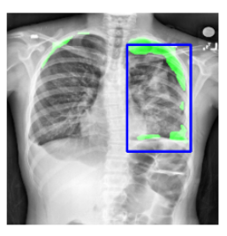
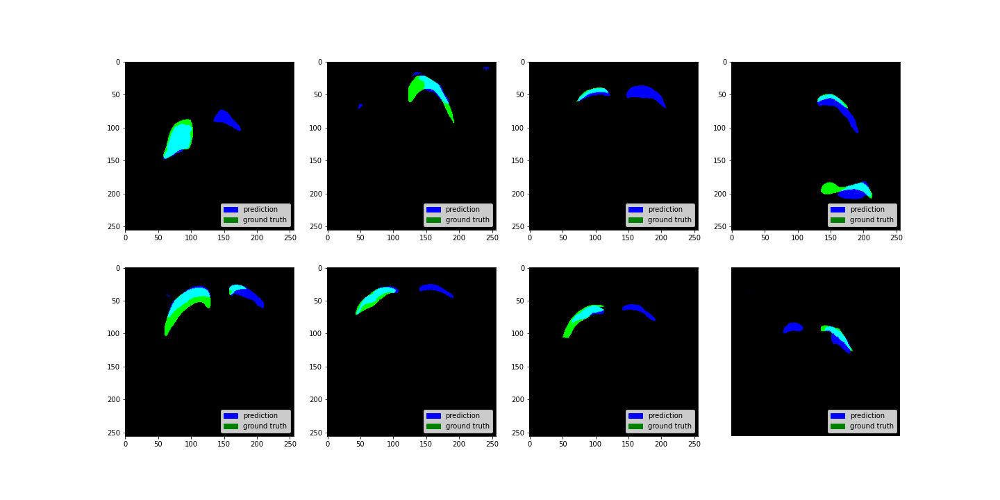
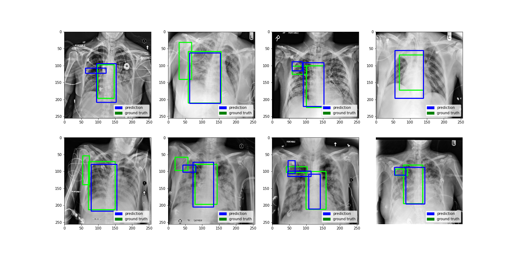

# MultiChexNet

## Tabel of contents
- [Introduction](#Introduction)
- [Example Results](#Example_Results)
- [Getting started](#Getting_started)
- [File Dataset ](#Dataset)

## Introduction
MultiChexNet is a model that is able to classify, detect, and segment chest related diseases in one forward propagation. We apply the concept of the [MultiNet architecture](https://arxiv.org/pdf/1612.07695.pdf) to medical images. This architecture did not only speed up inference time for the three tasks but we also saw improvements over training individual models at a time. 

## Example_Results
**Segmentation results** 

**Detection results** 

## Getting_started
Training steps

## Datasets
Multiple dataset were used for the training process, and they are the following: 
* [NIH_chest_xrays](https://www.kaggle.com/nih-chest-xrays/data)
* [RSNA](https://www.kaggle.com/c/rsna-pneumonia-detection-challenge)
* [SIMM-ACR](https://www.kaggle.com/jesperdramsch/siim-acr-pneumothorax-segmentation-data)
